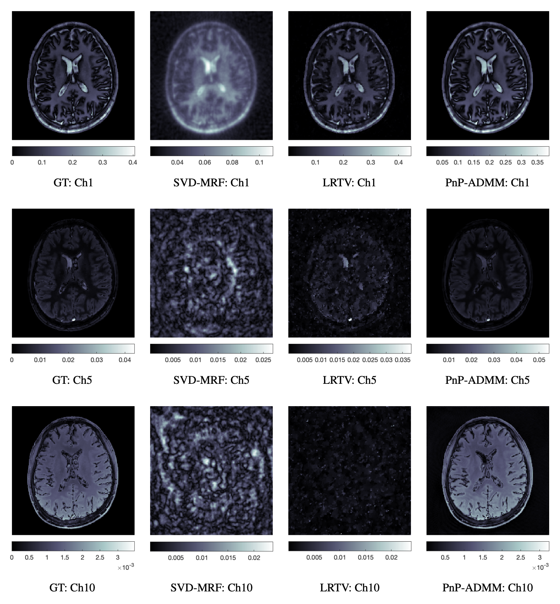
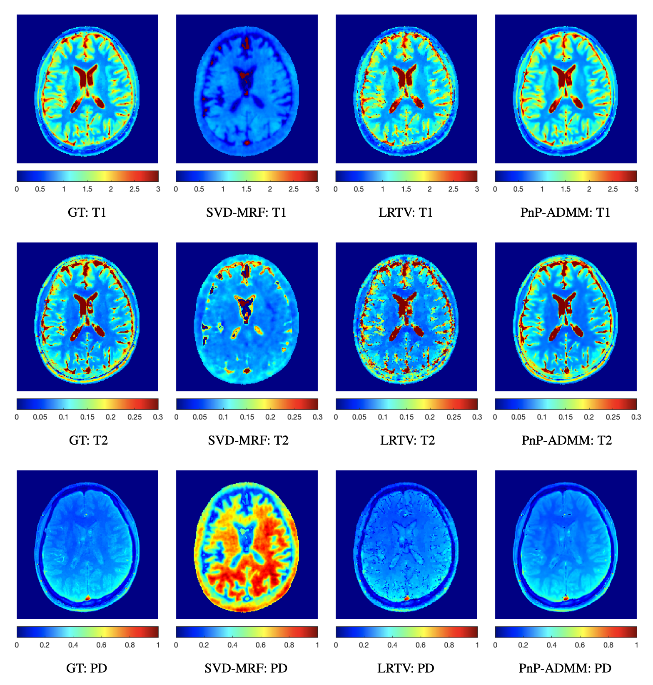
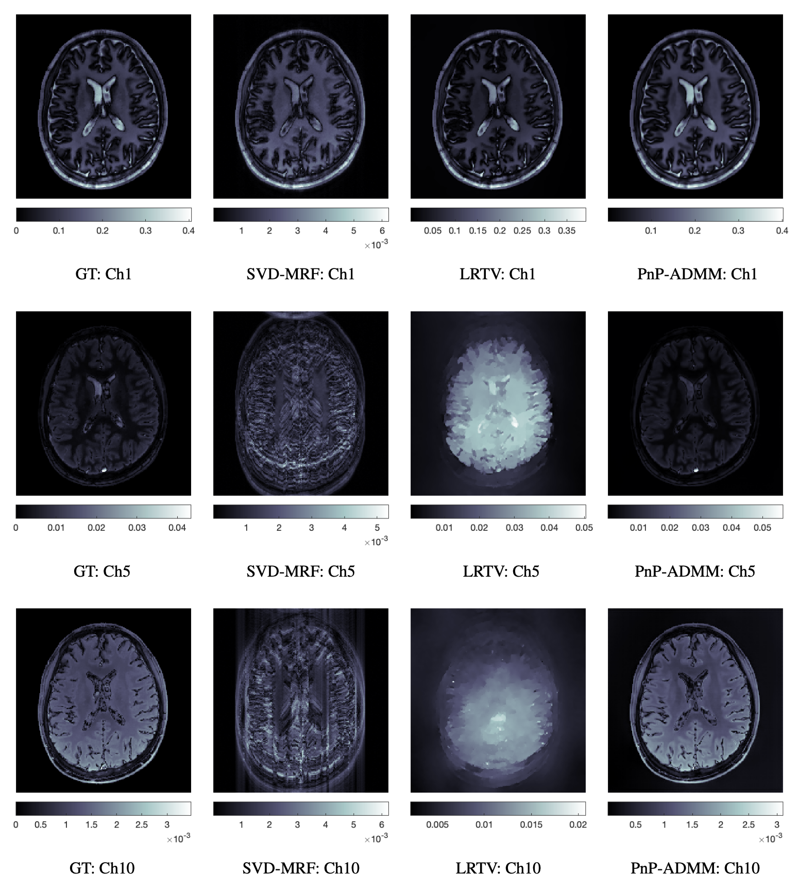
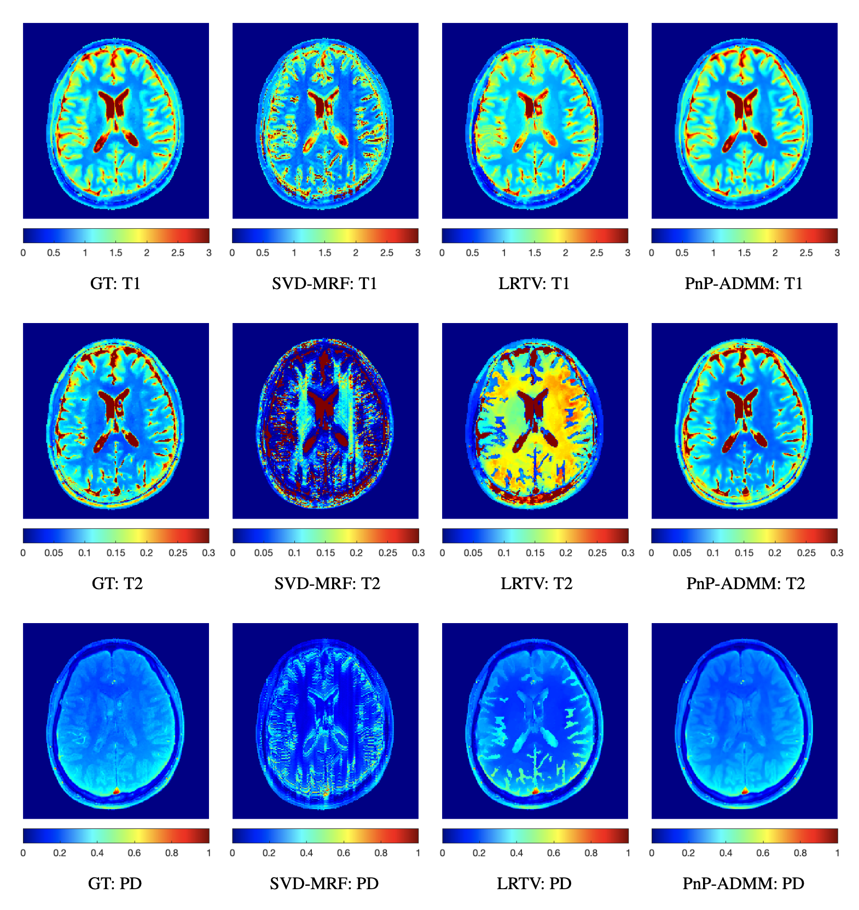

# Plug-and-Play Magnetic Resonance Fingerprinting based Quantitative MRI Reconstruction using Deep Denoisers (Proof of Concept) (IEEE ISBI 2022)


[Ketan Fatania](https://researchportal.bath.ac.uk/en/persons/ketan-fatania), Carolin M. Pirkl, Marion I. Menzel, Peter Hall and [Mohammad Golbabaee](https://mgolbabaee.wordpress.com)

Paper: [IEEE ISBI 2022](https://doi.org/10.1109/ISBI52829.2022.9761603), [arXiv](https://doi.org/10.48550/arXiv.2202.05269)

<br/>

## Abstract

Current deep learning approaches to Quantitative MRI - Magnetic Resonance Fingerprinting (QMRI-MRF) build artefact-removal models customised to particular k-space subsampling patterns. This research proposes an iterative deep learning Plug-and-Play Alternating Direction Method of Multipliers (PnP-ADMM) reconstruction approach to QMRI-MRF which is adaptive to the forward acquisition process. Initially, a Convolutional Neural Network (CNN) is trained to remove generic white gaussian noise (not a particular subsampling artefact) from Time-Series Magnetisation Images (TSMIs). The denoiser is then plugged into the PnP-ADMM algorithm and tested with two subsampling patterns. The results show consistent reconstruction performance of TSMIs against both subsampling patterns and accurate inference of T1, T2 and Proton Density tissue maps.

<br/>

## Spiral Subsampling

A gridded spiral subsampling pattern was used to subsample 771 k-space locations from a total of 224 x 224 = 50,176 k-space locations per timeframe (channel). This resulted in an acceleration factor of 501,760 / 7710 = 65.

<br/>

### Spiral Subsampling: TSMI Reconstruction



**Fig.1** - A visual comparison of the reconstructed TSMIs obtained using the Spiral Subsampling pattern for channels 1, 5 and 10, for slice 10 of 15.

<br/>

### Spiral Subsampling: Tissue Map Inference



**Fig.2** - A visual comparison of the T1, T2 and Proton Density tissue maps obtained after mapping of reconstructed Spiral Subsampled TSMIs for slice 10 of 15.

<br/>

## EPI Subsampling

A gridded EPI subsampling pattern was used to subsample approximately 771 k-space locations from a total of 224 x 224 = 50,176 k-space locations per timeframe (channel). This resulted in an acceleration factor of 501,760 / 7710 = 65.

<br/>

### EPI Subsampling: TSMI Reconstruction



**Fig.3** - A visual comparison of the reconstructed TSMIs obtained using the EPI Subsampling pattern for channels 1, 5 and 10, for slice 10 of 15.

<br/>

### EPI Subsampling: Tissue Map Inference



**Fig.4** - A visual comparison of the T1, T2 and Proton Density tissue maps obtained after mapping of reconstructed EPI Subsampled TSMIs for slice 10 of 15.

<br/>

## Proof of Concept

This work is a proof of concept for Magnetic Resonance Fingerprinting based Quantitative MRI with certain caveats: the TSMIs reconstructed were real-valued, uniform FFT was used, and the acquisition processes were single-coiled simulations with gridded subsampling patterns. We plan to address these issues in future research.

<br/>

## Requirements and Dependencies

### Matlab

- Tested with `Matlab 2021a`.
- Requires the `Deep Learning Toolbox Converter for ONNX Model Format` add-on / app to use `importONNXNetwork()`. Tested with `version 21.1.2`.

### Python

- An environment can be created using `python_dependencies.txt` in `./PyTorch_Denoiser/dependencies/`.
- The order of packages, and the package's dependencies, that were installed in a newly created Anaconda environment with `Python 3.8.10`: `PyTorch 1.7.1`, `OpenCV 4.4.0`, `Matplotlib 3.2.2`, `SciPy 1.4.1`, `scikit-image 0.17.2`, `TensorBoard 2.5.0`, `Torchvision 0.8.2`.

<br/>

## Datasets

A dataset of quantitative T1, T2 and PD tissue maps (QMaps) of 2D axial brain scans of 8 healthy volunteers across 15 slices each were used. The "ground-truth" tissue maps were computed from long FISP aqcuisitions with T=1000 timepoints using the LRTV reconstruction algorithm.

The dataset used was provided by GE Healthcare and is not available to be shared.

For demo purposes, we hope to provide a dataset from the [BrainWeb Project](https://brainweb.bic.mni.mcgill.ca/anatomic_normal_20.html) soon!

<br/>

## PnP-ADMM (Matlab) (Demo)

- Download the dataset to `./datasets/gt_qmaps/` using the link provided in `./datasets/README.md`.
- Download the denoiser models to `./onnx_models/real_fisp_cut3_onnx_models/` using the link provided in `./onnx_models/README.md`.
- Create the TSMIs from the QMaps by running `main_synthesize_tsmis.m`. The TSMIs will be saved to `./datasets/synth_tsmis/real_fisp_cut3_tsmis/`.
- Set options at the beginning of `main_recon_syth_FFT.m`. In particular, `cut`, `subsampling_pattern`, `recon_method`, `denoiser_type` and `noise_map_std` (for multi-level denoiser).
- Run `main_recon_syth_FFT.m`.

<br/>

## Training and Testing a Denoiser (PyTorch)

### Creating Python TSMIs from Matlab TSMIs

- Open `main_save_python_tsmis.py`.
- Set options. In particular, `args.cut` and `args.python_train_test_split`.
- Run `main_save_python_tsmis.py`.
- By default, Matlab training and testing TSMIs will be read from `./datasets/synth_tsmis/real_fisp_cut[cut_number]_tsmis/` and Python training and testing TSMIs will be saved in `./PyTorch_Denoiser/datasets/real_fisp_cut[cut_number]_float64_pkl/`.

### Training a Denoiser

#### Training a Model

- Open `main_train.py`.
- Set options in `train_init_settings()`. In particular, `args.cut`, `args.network_architecture`, `args.gauss_std` (for single-level denoiser) and `args.gauss_blind_std` (for multi-level denoiser).
- Run `main_train.py`.
- The checkpoints will be saved to `./PyTorch_Denoiser/checkpoints/` and the final model will be saved to `./PyTorch_Denoiser/final_pt_models/real_fisp_cut[cut_number]_pt_models/`.

#### Resuming Training

- Open `main_train.py`.
- In train_init_settings(), set `args.resume_training = 'on'`, set `args.resume_training_path` to the relevant checkpoint and set `args.resume_training_sumwri_dir` to the relevant summary writer folder.
- Run `main_train.py`.

### Testing a Denoiser

- Open `main_test.py`.
- Set options in `test_init_settings()`. In particular, `args.cut`, `args.network_architecture`, `args.load_test_model...` and `args.gauss_std` (for single-level and multi-level denoisers).
- Run `main_test.py`.
- A comparison figure and metrics will be displayed for each channel of the test slice. To display the figure and metrics of the next channel, close the open figure. To finish testing before iterating through all channels, stop the program.

<br/>

## Exporting PyTorch Model to ONNX and Importing ONNX Model to Matlab

### To export the PyTorch model to ONNX
Note: For more information on how the PyTorch model is exported to ONNX, see `export_to_onnx()` in `utils.py`.

- Open `main_test.py`.
- Set `args.load_test_model...` to where the trained model is located and set `args.save_onnx_model...` to where the ONNX model should be saved. By default, the ONNX file will be saved to `../onnx_models/real_fisp_cut[cut_number]_models/`.
- Set `args.export_onnx_model` to `'on'`.
- Run `main_test.py`.

### To import the ONNX model to Matlab
Note: For more information on how the ONNX model is imported to Matlab, see the section `%% Load PyTorch TSMI Denoiser ...` in `main_recon_tsmis_FFT.m`.

- Open `main_recon_tsmis_FFT.m`.
- Set `single_level_denoiser_filename` or `multi_level_denoiser_filename` to the filename of the ONNX model to be imported.
- Set other options. In particular `cut`, `denoiser_type` and `noise_map_std` (if using a multi-level denoiser).
- Run `main_recon_tsmis_FFT.m`.

<br/>

## Citation

If you found this research and / or repository useful, please cite this paper:

```
@inproceedings{ref:fatania2022,
    author = {Fatania, Ketan and Pirkl, Carolin M. and Menzel, Marion I. and Hall, Peter and Golbabaee, Mohammad},
    booktitle = {2022 IEEE 19th International Symposium on Biomedical Imaging (ISBI)},
    title = {A Plug-and-Play Approach To Multiparametric Quantitative MRI: Image Reconstruction Using Pre-Trained Deep Denoisers},
    year = {2022},
    pages= {1-4},
    doi = {10.1109/ISBI52829.2022.9761603},
    code = {https://github.com/ketanfatania/QMRI-PnP-Recon-POC}
    }
```

<br/>

## Contact

If you have any questions, please feel free to email me:
```
Ketan Fatania
University of Bath
kf432@bath.ac.uk
```
